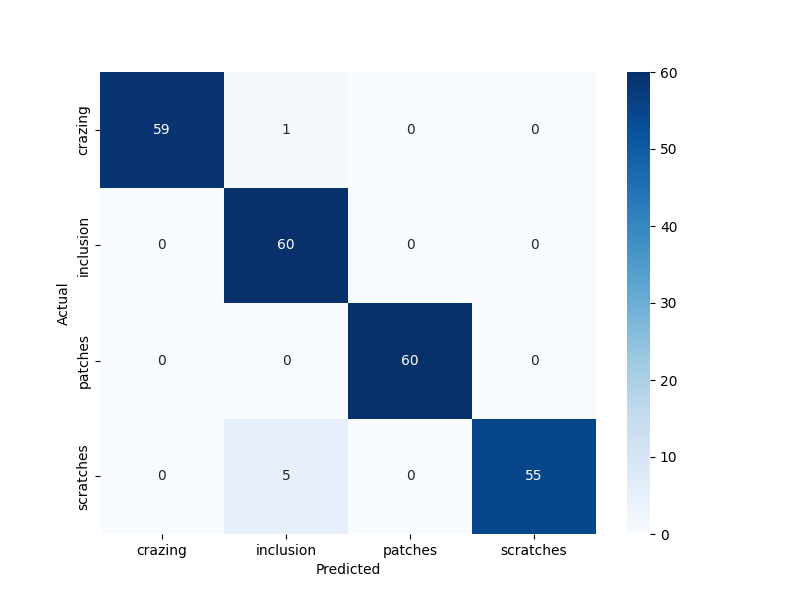
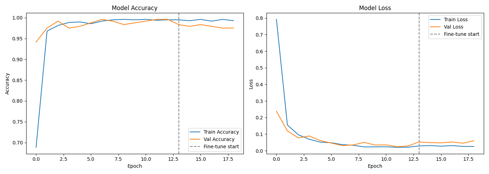
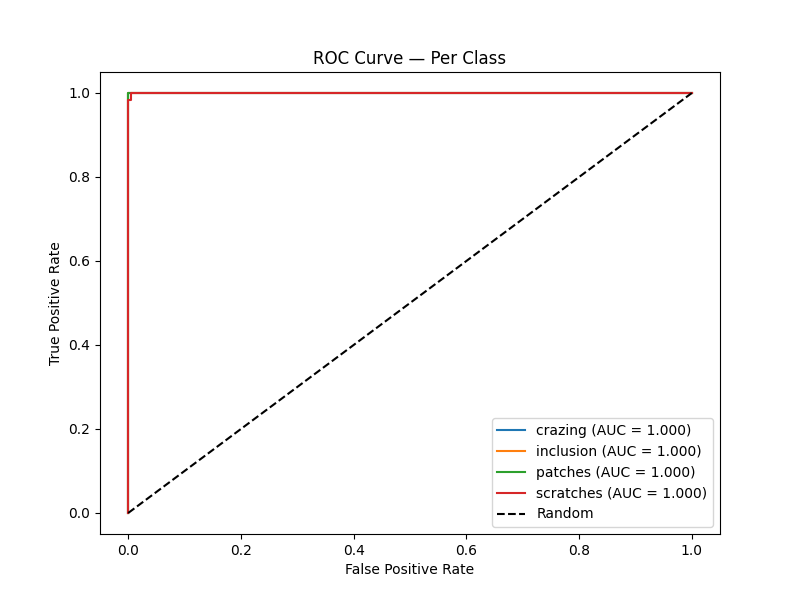
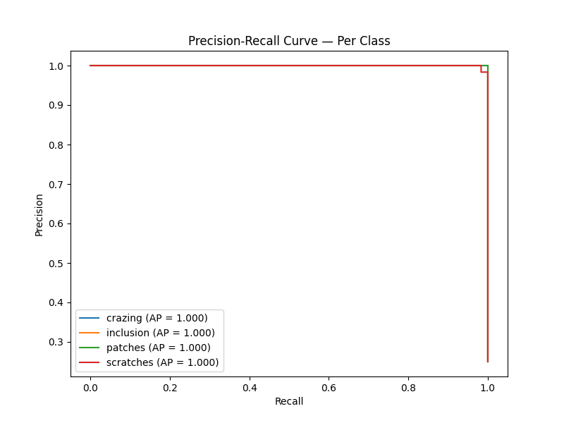
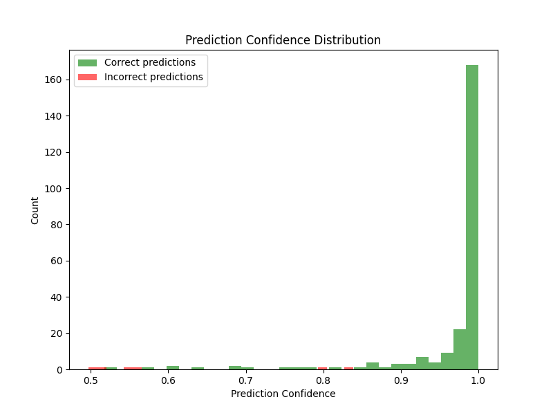
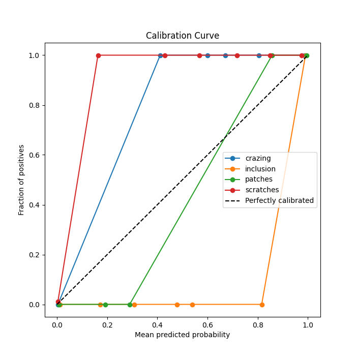
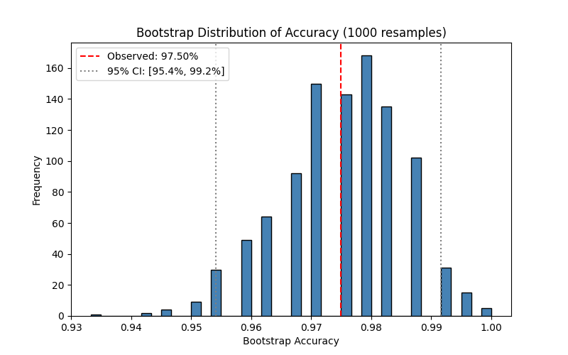
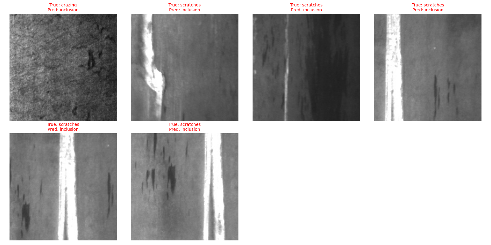

# Surface-defects-classification-of-the-hot-rolled-steel-strip

A ResNet50-based deep learning model for automated visual inspection of hot-rolled steel surfaces, built using the Aargus DIY visual inspection Tool. The model classifies steel surface defects into 4 categories with **97.5% accuracy**.


---

## Overview

This model performs automated visual inspection of hot-rolled steel surfaces to detect and classify manufacturing defects, replacing slow and inconsistent manual inspection with a fast, consistent AI-based system. It was built using the Aargus DIY visual inspection tool— covering data ingestion, augmentation, transfer learning, and statistical validation.

**Defect Classes:** `crazing`, `inclusion`, `patches`, `scratches`

---

## Methodology

1. **Data Ingestion** — Stratified 80/20 train-validation split
2. **Preprocessing & Augmentation** — rotation, horizontal/vertical flip, zoom, and brightness variation applied to improve generalization
3. **Model Architecture** — ResNet50 backbone (ImageNet pretrained), trained in two phases:
   - Phase 1: frozen base warm-up (13 epochs)
   - Phase 2: selective fine-tuning of the last 60 layers (6 epochs)
4. **Class Balancing** — computed class weights to address any dataset imbalance
5. **Validation** — classification metrics (Precision, Recall, F1), confusion matrix analysis, ROC-AUC curves, precision-recall curves, and bootstrap confidence intervals for statistical robustness

---

## Performance

### Overall Metrics

| Metric | Score |
|---|---|
| Accuracy | **97.50%** |
| Matthews Correlation Coefficient (MCC) | 0.9674 |
| Cohen's Kappa | 0.9667 |
| Top-2 Accuracy | 99.17% |
| 95% Confidence Interval (bootstrap, 1000 resamples) | [95.42%, 99.17%] |

### Per-Class Results

| Class | Accuracy | AUC | Precision | Recall | F1-Score | Support |
|---|---|---|---|---|---|---|
| Crazing | 98.33% | 1.000 | 1.00 | 0.98 | 0.99 | 60 |
| Inclusion | 100.00% | 1.000 | 0.91 | 1.00 | 0.95 | 60 |
| Patches | 100.00% | 1.000 | 1.00 | 1.00 | 1.00 | 60 |
| Scratches | 91.67% | 1.000 | 1.00 | 0.92 | 0.96 | 60 |

**Total misclassified:** 6 out of 240 validation images

### Confidence Analysis

| | Mean Confidence |
|---|---|
| Correct predictions | 0.9681 |
| Incorrect predictions | 0.6244 |

The large gap between correct and incorrect prediction confidence indicates the model is well-calibrated — it tends to be less confident when it makes a mistake, rather than being confidently wrong.


---

## Visual Results


### Confusion Matrix

 
### Training Curves (Accuracy & Loss)

 
### ROC Curve — Per Class

 
### Precision-Recall Curve — Per Class

 
### Prediction Confidence Distribution

 
### Calibration Curve

 
### Bootstrap Accuracy Distribution (95% CI)

 
### Misclassified Examples

 
---

## Usage

### Installation

```bash
pip install tensorflow pillow numpy
```

### Load the model and predict

```python
import tensorflow as tf
from tensorflow.keras.applications.resnet50 import preprocess_input
import numpy as np
from PIL import Image

# Load model
model = tf.keras.models.load_model("final_model.h5")
class_names = ["crazing", "inclusion", "patches", "scratches"]

# Load and preprocess an image
img = Image.open("your_steel_surface_image.jpg").resize((224, 224))
arr = preprocess_input(np.array(img))
arr = np.expand_dims(arr, axis=0)

# Predict
preds = model.predict(arr)[0]
predicted_class = class_names[np.argmax(preds)]
confidence = np.max(preds)

print(f"Predicted defect: {predicted_class} ({confidence*100:.2f}% confidence)")
```

---

## Use Case

Industrial quality control automation for steel manufacturing — reduces manual inspection time and improves defect detection consistency across production lines.

---

## Links

| Platform | Link |
|---|---|
| AIKosh (India AI) |  |
| Hugging Face |  |

---

## Built With

- TensorFlow / Keras
- ResNet50 (ImageNet pretrained)
- scikit-learn (evaluation metrics)
- Google Colab (training environment)

---

## License

This project is licensed under the MIT License.

---

## Author

**Aargus ** — DIY Visual Inspection AI Platform

